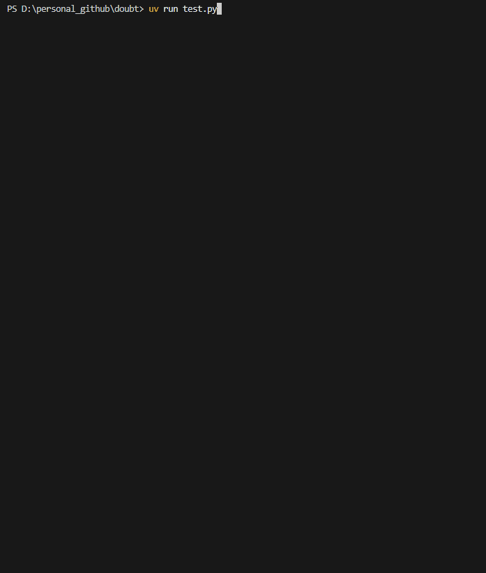

## Example output



# doubt

Discover hidden assumptions about data completeness in Python functions.

`doubt` is a lightweight developer tool that helps you understand how missing data affects the behaviour of your functions — whether that means crashes, silent output changes, or unexpected type changes.

------------------------------------------------------------------------

## Why doubt?

Most Python functions implicitly assume that inputs are complete.

In practice:

-   Lists have missing elements
-   Floats become NaN
-   Pandas objects contain nulls
-   Configuration values disappear
-   Upstream pipelines silently drop data

The problem is not just crashes — it is silent behavioural change.

`doubt` helps answer questions like:

-   Which inputs break my function if data is missing?
-   Where does missing data change outputs silently?
-   How sensitive is my function to partial data loss?

------------------------------------------------------------------------

## What doubt does (and does not do)

### What it does

-   Systematically injects missing values into function inputs

-   Re-runs the function under controlled perturbations

-   Compares behaviour against a baseline

-   Classifies outcomes:

    -   Crash
    -   Silent change
    -   Type change
    -   No impact

-   Works with:

    -   Python primitives
    -   Lists, tuples, dicts
    -   NumPy arrays
    -   Pandas Series and DataFrames

-   Can be used interactively or in tests

### What it does not do

-   It does not guess intent or correctness
-   It does not impute data
-   It does not modify your logic
-   It does not replace tests or validation

`doubt` is a diagnostic lens, not a policy engine.

------------------------------------------------------------------------

## Installation

``` bash
pip install doubt
```

------------------------------------------------------------------------

## Basic usage

Decorate any function you want to inspect:

``` python
from doubt import doubt

@doubt()
def calculate_mean(values):
    return sum(values) / len(values)
```

Run the analysis explicitly:

``` python
result = calculate_mean.check([1, 2, 3, 4, 5])
result.show()
```

Doubt Analysis: calculate_mean()

======================================================================

Baseline Output: 3.0

**Tested 5 scenarios**

-   Crashes: 5
-   Silent Changes: 0
-   Type Changes: 0
-   No Impact: 0

Concerning Scenarios:

| Argument | Location | Impact | Details   |
|----------|----------|--------|-----------|
| values   | \[0\]    | Crash  | TypeError |
| values   | \[1\]    | Crash  | TypeError |
| values   | \[2\]    | Crash  | TypeError |
| values   | \[3\]    | Crash  | TypeError |
| values   | \[4\]    | Crash  | TypeError |

Suggestions:

-   Add defensive checks for None/NaN values
-   Consider using try-except blocks
-   Problematic arguments: values

------------------------------------------------------------------------

## Example: silent change detection

``` python
@doubt()
def safe_sum(values):
    return sum(v for v in values if v is not None)

result = safe_sum.check([1, 2, 3, 4, 5])
result.show()
```

This reveals how the output changes as values are removed, even though the function does not crash.

------------------------------------------------------------------------

## Using doubt in tests

`doubt` includes a pytest-friendly helper:

``` python
from doubt import assert_missing_robust

def test_safe_sum():
    assert_missing_robust(
        safe_sum,
        [1, 2, 3, 4, 5],
        max_relative_change=0.3
    )
```

The test fails if:

-   The function crashes with missing data
-   Output changes exceed a defined threshold
-   Output types change unexpectedly

This makes missing-data robustness a first-class test concern.

------------------------------------------------------------------------

## Performance considerations

-   `doubt` runs only when `.check()` is called
-   Normal function calls have zero overhead
-   Scenario count is bounded via `max_scenarios_per_arg`
-   Designed for development and testing, not production hot paths

------------------------------------------------------------------------

## Design philosophy

-   Explicit over implicit
-   Observation over enforcement
-   Generic over framework-specific
-   Useful defaults, minimal configuration

Inspired by practical tooling in the Python ecosystem, but focused specifically on data completeness assumptions.

------------------------------------------------------------------------

## Limitations

-   Functions using `*args` or `**kwargs` are partially supported
-   Positional-only arguments are not fully supported
-   Semantic correctness cannot be inferred automatically

These are design trade-offs, not bugs.

------------------------------------------------------------------------

## Who is this for?

-   Engineers working with real-world, imperfect data
-   Data scientists validating pipeline robustness
-   Library authors documenting behavioural assumptions
-   Anyone who has been bitten by silent NaNs

------------------------------------------------------------------------

## Contributing

Contributions are welcome, especially:

-   Additional perturbation strategies
-   Better numeric comparison logic
-   Improved pandas and NumPy coverage
-   Documentation and examples

Open an issue or submit a pull request.

------------------------------------------------------------------------

## License

MIT